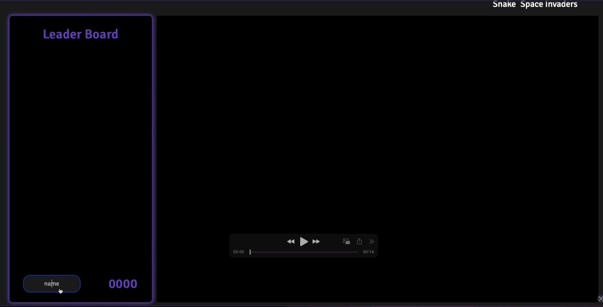

## Description:
A Arcade web page application. Project developed so people can have fun with friends and compete with each other, the development of this web page required Dom's manipulation, knowledge of events, Elements and Local Storage.

**Games available**:

- Snake;
- Flappy Bird

## Starting Project:
1. Cloning the repository
-  `git clone git@github.com:Vincenzofdg/Arcade_Games.git`
2. Enter in the directory folder
- `cd Arcade_Games`
3. Iniciate `server.mjs`
- `node server.mjs`

 

